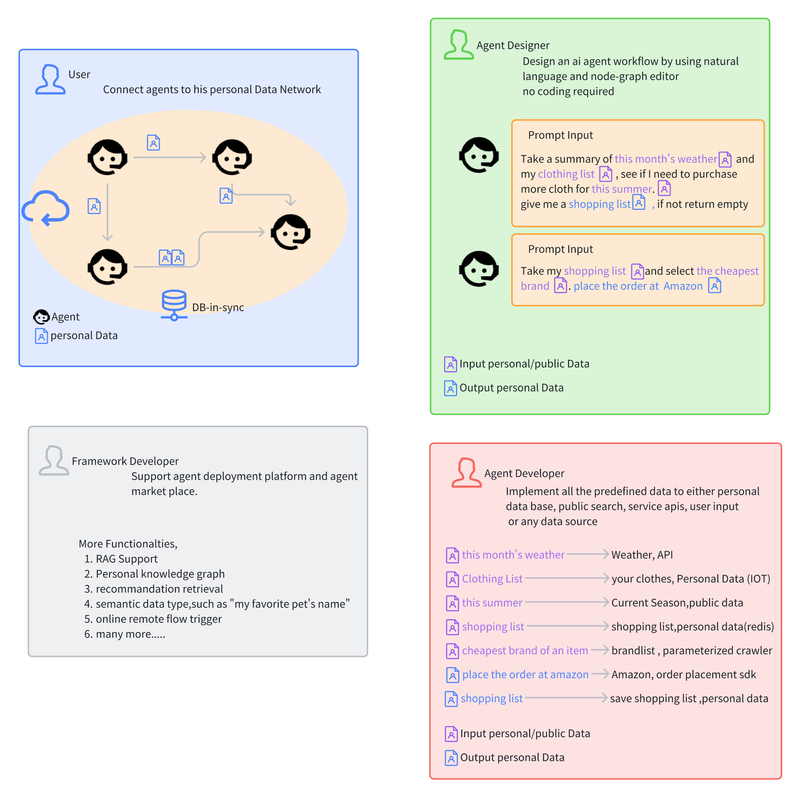
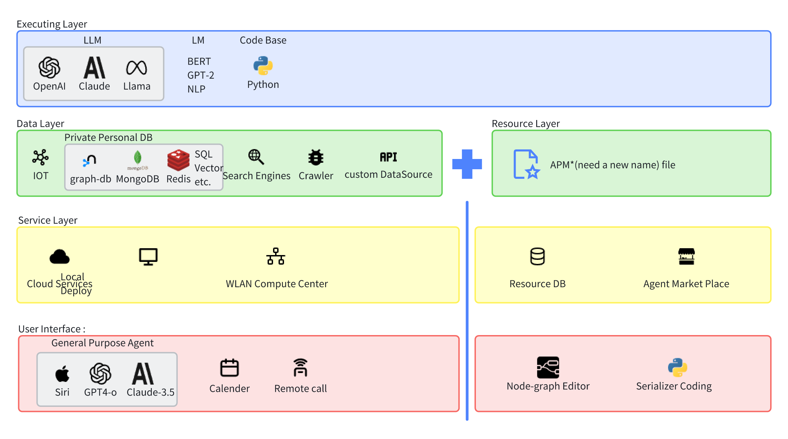

# AgentBlueprint
## Table of Contents
- :memo:[Overview](#overview)
- :star2:[Concept](#concept)
- :triangular_flag_on_post:[Development-State](#current-state)
- :pushpin:[Getting Started](#getting-started)
- :question:[Common Questions](#faq)
- :paintbrush:[Project Structure](#project-structure)
- :clipboard:[Data Structure](#data-structure)
- [License](#license)

***
## Overview
AgentBlueprint is a base framework that deeply connects between application code and LLM.
## Concept
AgentBlueprint has roughly 3 parts:
1. **Single Agent Blueprint**: A blueprint is a pre-defined structure of Data/Prompts that represents how the agent should behave in a controllable fashion.
2. **Data-Driven Structure**: The entire framework is data-driven, meaning that most of the data variable that might be used later in the LLM is pre-generated in the framework. This allows a frictionless connection between the application data and the LLM.
3. **Multi-Agent Support**: Because of the data-driven structure and self-determined nature of each agent, multi-agent support is a natural feature of the framework. 

## Project Structure

## Data Structure

## Current State
- [X] Game Agent
- [ ] Python Support
- [ ] General Agent Functionalities (Copilot, etc.)
- [ ] Blueprint Node-Graph Edtor

---
# Getting Started
1. This project has two repositories: one in Golang and one in Python. Installing both environments is required to run the project (for now).
2. install `protoc` with grpc plugin for python and golang
```python
pip install grpcio-tools
```
```golang
go install google.golang.org/protobuf/cmd/protoc-gen-go@v1.28
go install google.golang.org/grpc/cmd/protoc-gen-go-grpc@v1.2
```
3. The whole project is build upon a data-driven structure, Start by defining all data/ function(data pipline) under `/DataConfig[EDIT ME]/`  that might be used later. See Section [] for detail explanation.
4. Run Generate.bat for windows.
5. Implement some code.
- Implement the data source at `golang-client/implementation/impl_gen_XXX`
  >when the data structure is generate, the data source needs to be connected to the original source, could be a database,RAG,runtime variable,temporary cache, etc.

6. Write APM (Agent Personality Module).
   > APM file is the core blueprint of each agent, it contains every task's prompt. APM assembles runtime data with a data placeholder and prompt to execute a complete query.
7. Initialize agent at `golang-client/client_object/agent_entity.go` and deserialize the pre-defined APM to load to the `AgentEntity` by calling `DeserializeAPMToEntity` function.
8. Run the generated pipelines at `golang-client/client_object/entity_function_gen.go` returns the result of the Query.
---
## Step by Step Guide On how to use the framework
#### To Build a Generative Agent Multi Agent Demo
==Checkout Demo-GA branch==


---
## FAQ
1. **What does DataInstance Do?** <br>
DataInstance is the data structure that contains the data itself, context information, and chaining information indicating where this data originated (always another DataInstance). It serves as the equivalent replacement for a data variable within the agent class.
> In our vision, this Project will be built upon Data Instance structure entirely. DataInstance is the intermediate structure that connects between blueprint's runtime data call, LLM's query result, database's data retrieval. It more of a ECS(EntityComponentSystem) design pattern.
2. **Why uses Data-Oriented Design?** <br>
There are many reasons for that:
   - *More controllable and retrievable data.*<br> In AI app development, results returned by LLM are often used later in the application. Hence, having a data structure that is easily retrievable and manipulable is advantageous.
   - *RAG support*<br> Supports RAG (though not yet shown in this project). Experimentation with RAG shows that a clear data structure significantly improves retrieval quality from a graph perspective. Moreover, providing a structure beforehand facilitates frictionless indexing according to the application's data structure.
   - *Context Awareness*<br> Each DataInstance is connected with a unique context reference. This enables easy traversal of logical connections between data, akin to a tree structure (Tree of Thoughts/Chain of Thoughts). Context design also allows tasks to be executed in parallel or from desired nodes in the past, rather than strictly sequentially.
   - *Blueprint Support*<br> Initially, this project aimed to perform runtime data queries with LLM. However, dynamically retrieving different data required extensive work. Therefore, we developed a common data interface that adapts to data indexing, enabling assembly at the resource level during runtime.
3. **What Is .apm File** <br>
APM or .apm file is a unique file format we defined, referring to Agent Blueprint/Assembly Structure. It encapsulates prompt information using protobuf encoding. Each task can contain one or more unique LLM/LM prompts, where runtime/static data is replaced by a placeholder. Assembly occurs when the task is called, and placeholders are substituted with actual data.<br>
   #### Examples:
    ```
    "{agent_information} \n" + \
    "Yesterday activities: {daily_summary} \n" + \
    "In addition, he has a special mission today, {today's mission}" + \
    "with the above information provide a plan that this agent will do \n" + \
    ```
   or 
    ```
    Currently {agent_name} saw {interact_object_name}is in {interact_object_state} State,
    Now {agent_name} is at {agent_location} in the {current_time},
    What would he do next to react to this current situation?
   ```
   Even with the same task, providing different .apm assemblies (blueprints) results in different queries. This flexibility is core to the blueprint structure, allowing tasks to be interchangeable and customizable.
## License

This project is licensed under the [MIT](LICENSE).